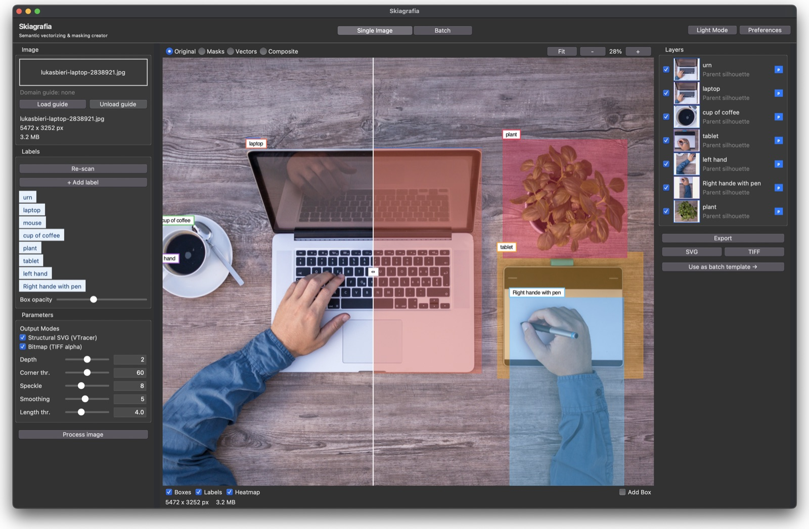

# Skiagrafia

> **Semantic Vectorizing and Masking Creator**
>
> A desktop application for AI-powered image segmentation, masking, and vectorization.

[](https://www.python.org/downloads/)
[](https://developer.apple.com/documentation/techdocs/50056847)
[](docs/CLAUDEv5.md)

**Skiagrafia** uses local ML models to automatically segment images into semantic layers (objects and their parts), producing both vector (SVG) and bitmap (TIFF/PNG) outputs. Designed for designers and production workflows.

<p align="center">
  
</p>

---

## Quick Start

```bash
# Clone and install
git clone <repository-url> && cd skiagrafia
python -m venv venv && source venv/bin/activate
pip install -e .

# Start Ollama (required)
ollama serve &
ollama pull moondream

# Run the application
python main.py
```

---

## Table of Contents

1. [Overview](#overview)
2. [Features](#features)
3. [System Requirements](#system-requirements)
4. [Installation](#installation)
5. [Quick Start](#quick-start)
6. [Operating Modes](#operating-modes)
7. [Architecture v5.1](#architecture-v51)
8. [Pipeline Details](#pipeline-details)
9. [ML Models](#ml-models)
10. [User Interface](#user-interface)
11. [Configuration](#configuration)
12. [Output Formats](#output-formats)
13. [API Reference](#api-reference)
14. [Troubleshooting](#troubleshooting)
15. [License](#license)

---

## Overview

Skiagrafia addresses a common challenge in design and production workflows: converting raster images into clean, layered vector artwork with precise masks. Traditional approaches require manual tracing and masking, which is time-consuming and error-prone. Skiagrafia automates this process using state-of-the-art machine learning models running entirely locally on your machine.

### Key Capabilities

- **Semantic Understanding**: Automatically identifies objects and their constituent parts (e.g., a monitor with screen, stand, and bezel)
- **Precision Segmentation**: Uses SAM 2.1 HQ for high-quality mask generation
- **Alpha Matting**: VitMatte refinement for hair, fur, and transparent edges
- **Vector Output**: VTracer converts bitmaps to clean SVG paths
- **Batch Processing**: Process thousands of images with a wizard-driven workflow
- **100% Local Inference**: No cloud APIs; all models run on your machine

---

## Features

### Single Image Mode

- Interactive designer workflow with live preview
- Drag-and-drop image import
- Real-time layer visualization
- Iterative refinement with adjustable parameters
- Export to SVG, TIFF, PNG, and PDF

### Batch Mode

- Six-step wizard for production pipelines
- Process 2,000+ images in parallel
- Human-in-the-loop label triage (mandatory gate)
- Persistent state with resume capability
- Template system for reusable configurations
- Progress tracking and error recovery

### ML Pipeline (10-step)

- **Moondream 2**: Semantic interrogation via Ollama with fallback chain
- **GroundingDINO**: Text-to-bounding-box detection
- **SAM 2.1 HQ**: State-of-the-art segmentation
- **VitMatte**: High-quality alpha matting
- **VTracer**: Bitmap-to-SVG spline fitting

### Domain Guides

- TOML-based knowledge packs that teach Moondream which objects to look for
- Built-in GUI editor inside Preferences (Domain Guides tab)
- Define canonical names, aliases, detector phrases, and child parts per object
- Live TOML preview as you edit
- Batch defaults (preferred VLM, tiling, fallback chain) per domain

### Technical Features

- Contract-based architecture with Protocol interfaces
- Dependency injection via CapabilitySet
- User-configurable model directory
- Apple Silicon optimized (MPS acceleration)
- Lazy model loading with memory residency
- ProcessPoolExecutor parallelization
- SQLiteDict state persistence

---

## System Requirements

### Hardware

| Requirement | Minimum | Recommended |
|-------------|---------|-------------|
| **Platform** | Apple Silicon Mac | M1 Ultra or better |
| **Memory** | 32 GB | 64-128 GB unified memory |
| **Storage** | 20 GB free | 50 GB for model weights |
| **GPU** | MPS capable | Metal Performance Shaders |

### Software

- **Operating System**: macOS 12.0 (Monterey) or later
- **Python**: 3.11 or later
- **Ollama**: Running locally at `http://localhost:11434`

### Model Weights

The following model weights must be available:

| Model | Filename | Size |
|-------|----------|------|
| GroundingDINO | `groundingdino_swint_ogc.pth` | ~660 MB |
| SAM 2.1 HQ | `sam2.1_hiera_large.pt` | ~2.4 GB |
| VitMatte ViT-B | `vitmatte-base-composition-1k/` | ~350 MB |
| Moondream 2 | Pulled via Ollama | ~1.5 GB |

---

## Installation

### 1. Clone the Repository

```bash
git clone <repository-url>
cd skiagrafia
```

### 2. Create Virtual Environment

```bash
python -m venv venv
source venv/bin/activate
```

### 3. Install Dependencies

```bash
pip install -e .
```

Or using the provided shell script:

```bash
./run.sh
```

### 4. Install Ollama and Moondream

```bash
# Install Ollama (if not already installed)
brew install ollama

# Start Ollama service
ollama serve

# Pull Moondream 2 model
ollama pull moondream
```

### 5. Download Model Weights

Model weights should be placed in the configured models directory (default: `~/ai/claudecode/mozaix/models/`). The application will prompt for download if weights are missing.

---

## Quick Start

### Launch the Application

```bash
# Direct execution
python main.py

# Or use the launcher script
./run.sh
```

### Single Image Workflow

1. **Drop an image** onto the canvas area
2. **Wait for interrogation** - Moondream analyzes the image
3. **Review labels** - Confirm or adjust detected objects
4. **Run pipeline** - Click "Process" to generate masks
5. **Export results** - Save as SVG, TIFF, PNG, or PDF

### Batch Workflow

1. **Import** - Select a folder or load a template
2. **Configure** - Set output options and VTracer parameters
3. **Interrogate** - Moondream scans all images (parallel)
4. **Triage** - Review and confirm labels (mandatory gate)
5. **Process** - Run the full pipeline on all images
6. **Output** - Review results and retry any failures

---

## Operating Modes

### Single Image Mode

Single Image Mode provides an interactive designer workflow with a three-panel layout:

```
+------------------+------------------------+------------------+
|                  |                        |                  |
|   Controls       |       Canvas           |     Layers       |
|                  |                        |                  |
|   - Image info   |   - Live preview       |   - Layer list   |
|   - Labels       |   - Zoom/pan           |   - Visibility   |
|   - Parameters   |   - Overlay toggles    |   - Ordering     |
|   - Actions      |                        |   - Export       |
|                  |                        |                  |
+------------------+------------------------+------------------+
```

**Features:**

- Real-time preview with zoom and pan
- Layer visibility toggles
- Parameter adjustment without re-running pipeline
- Individual layer export

### Batch Mode

Batch Mode provides a six-step wizard for processing large image collections:

```
Step 1: Import
    └── Select folder or load template
    └── Configure recursion depth
    └── Filter by file extension

Step 2: Configure
    └── Output mode (SVG, TIFF, PNG, PDF)
    └── VTracer parameters
    └── Naming conventions

Step 3: Interrogate
    └── Moondream scans all images
    └── Parallel processing with progress bar
    └── Generates parent/child label pairs

Step 4: Triage (MANDATORY GATE)
    └── Human reviews all labels
    └── Accept, reject, or edit labels
    └── Cannot proceed without triage

Step 5: Progress
    └── Orchestrator runs on all images
    └── ProcessPoolExecutor parallelization
    └── Real-time progress tracking

Step 6: Output
    └── Summary statistics
    └── Export bundles
    └── Retry failed jobs
```

**Key Features:**

- **Human Gate**: Step 4 (Triage) is mandatory before GPU pipeline runs
- **Resume Capability**: State persisted in SQLite, can resume interrupted batches
- **Template System**: Save and load batch configurations

---

## Architecture v5.1

v5.1 implements contract-based dependency injection with five capability protocols for decoupled model management and a lean 10-step structural pipeline.

### Design Principles

1. **Capability Protocols**: Five `@runtime_checkable` Protocol interfaces define contracts
2. **Dependency Injection**: Orchestrator receives `CapabilitySet` via constructor
3. **User-Configurable Models**: Model directory configurable via preferences
4. **Model Lifecycle Management**: `ModelManager` class handles discovery, download, and residency
5. **Lean Core**: Structural pipeline only -- segmentation and vectorization, no neural stylization

### Component Diagram

```
┌─────────────────────────────────────────────────────────────────┐
│                     UI Layer                                    │
│  main_window.py · left_panel.py · step_progress.py              │
│  batch_runner.py                                                │
│                                                                 │
│  Reads preferences → builds concrete clients → injects          │
│  them into Orchestrator via CapabilitySet                       │
└────────────────────────┬────────────────────────────────────────┘
                         │ passes CapabilitySet
                         ▼
┌─────────────────────────────────────────────────────────────────┐
│                   Orchestrator                                  │
│  Knows ONLY the Protocol interfaces.                            │
│  Never imports a concrete model client.                         │
└────────────────────────┬────────────────────────────────────────┘
                         │ calls Protocol methods
                         ▼
┌─────────────────────────────────────────────────────────────────┐
│              Capability Protocols (contracts.py)                │
│  Interrogator · Detector · Segmenter · AlphaRefiner ·           │
│  Vectorizer                                                     │
└────────────────────────┴────────────────────────────────────────┘
                         │ implemented by
                         ▼
┌─────────────────────────────────────────────────────────────────┐
│              Concrete Model Clients (models/)                   │
│  moondream_client.py · grounded_sam.py · vitmatte_refiner.py    │
│                                                                 │
│  Each receives its model path from ModelManager.                │
└────────────────────────┬────────────────────────────────────────┘
                         │ paths resolved by
                         ▼
┌─────────────────────────────────────────────────────────────────┐
│              ModelManager (model_manager.py)                    │
│  User-configurable models_dir from preferences.                 │
│  Registry of known models with download URLs.                   │
│  Device residency tracking and memory-aware unload.             │
└─────────────────────────────────────────────────────────────────┘
```

### Capability Protocols

| Protocol | Method | Concrete Implementation |
|----------|--------|------------------------|
| `Interrogator` | `interrogate()` | `GuidedInterrogator` (Moondream + fallbacks) |
| `Detector` | `detect_box()` | `GroundedSAM` (GroundingDINO) |
| `Segmenter` | `segment()`, `clear_cache()` | `GroundedSAM` (SAM 2.1 HQ) |
| `AlphaRefiner` | `predict()` | `VitMatteRefiner` |
| `Vectorizer` | `trace()` | `VTracerVectorizer` |

---

## Pipeline Details

### Single Image Pipeline (10 Steps)

The `Orchestrator` class executes a 10-step structural pipeline:

```
Step 1:  Load image as numpy array (BGR -> RGB)
Step 2:  Moondream interrogation — get parents, filter against confirmed labels,
         get children per confirmed parent
Step 3:  GroundingDINO detection — text-to-bounding-box per parent label
Step 4:  SAM 2.1 HQ parent segmentation — mask from bounding box prompt
         Tighten bbox from mask contour
Step 5:  SAM child segmentation — crop region, detect + segment per child,
         boolean-subtract children from parent body mask
Step 6:  Coordinate remapping — transform child masks from crop space to
         full image space, validate dimensions
Step 7:  VitMatte alpha refinement — generate soft alpha matte per layer,
         save 4-channel TIFF
Step 8:  Mask cleanup — bilateral filter, morphological close,
         remove small contours (<64 px)
Step 9:  VTracer vectorization — bitmap-to-SVG spline fitting per mask
Step 10: SVG assembly — group paths by layer hierarchy, write final SVG,
         update state to COMPLETE
```

### Batch Processing Architecture

```
┌─────────────────────────────────────────────────────────────────┐
│                        BatchRunner                              │
│                                                                 │
│  ┌─────────────────────────────────────────────────────────┐   │
│  │                  ProcessPoolExecutor                     │   │
│  │                                                          │   │
│  │   Worker 1        Worker 2        Worker 3        ...   │   │
│  │   ┌─────────┐     ┌─────────┐     ┌─────────┐           │   │
│  │   │Orchestr.│     │Orchestr.│     │Orchestr.│           │   │
│  │   │ Image A │     │ Image B │     │ Image C │           │   │
│  │   └─────────┘     └─────────┘     └─────────┘           │   │
│  │                                                          │   │
│  └─────────────────────────────────────────────────────────┘   │
│                              │                                 │
│                              v                                 │
│  ┌─────────────────────────────────────────────────────────┐   │
│  │                     StateManager                         │   │
│  │                                                          │   │
│  │   SQLiteDict: {job_id: JobRecord(status, result, ...)}   │   │
│  │                                                          │   │
│  └─────────────────────────────────────────────────────────┘   │
│                                                                 │
└─────────────────────────────────────────────────────────────────┘
```

---

## ML Models

### Moondream 2 (Semantic Interrogation)

**Purpose**: Analyzes images to identify objects and their constituent parts.

**Architecture**: Vision-language model running via Ollama HTTP API with fallback chain.

**Input**: Image (base64 encoded)

**Output**: Structured label list with parent/child relationships

**Fallback Chain**:
1. Primary VLM (Moondream or configured)
2. Fallback VLM (MiniCPM-V or configured)
3. Reasoner model (Qwen 3.5) for complex scenes

**Configuration**:
- Host: `http://localhost:11434`
- Model: `moondream` (configurable)
- Timeout: 60 seconds

### GroundingDINO (Object Detection)

**Purpose**: Converts text prompts to precise bounding boxes.

**Architecture**: Vision-language detection model (Swin-T backbone).

**Input**: Image + text prompt

**Output**: Bounding boxes with confidence scores

**Configuration**:
- Confidence threshold: 0.35 (adjustable)
- Text threshold: 0.25 (adjustable)
- Model: `groundingdino_swint_ogc.pth`

### SAM 2.1 HQ (Segmentation)

**Purpose**: Generates high-quality segmentation masks from bounding boxes.

**Architecture**: Segment Anything Model 2.1 with High Quality outputs.

**Input**: Image + bounding box prompt

**Output**: Binary segmentation mask

**Features**:
- Hiera Large backbone for precision
- MPS acceleration on Apple Silicon
- Automatic mask refinement

**Configuration**:
- Model: `sam2.1_hiera_large.pt`
- Device: MPS (Metal Performance Shaders)

### VitMatte (Alpha Matting)

**Purpose**: Refines mask edges for hair, fur, and transparent objects.

**Architecture**: Vision Transformer for natural image matting.

**Input**: Image + trimap (rough mask)

**Output**: Alpha matte (soft mask)

**Configuration**:
- Model: `vitmatte-base-composition-1k`
- Device: MPS or CPU fallback

---

## User Interface

### Main Window

The main window provides the application shell with:

- **Title Bar**: Application branding and window controls
- **Mode Switcher**: Segmented control for Single/Batch modes
- **Content Area**: Swappable view for current mode
- **Preferences Access**: Settings modal via gear icon

### Single Image Mode

Three-panel layout:

**Left Panel (Controls)**:
- Image information display
- Label list with checkboxes
- Parameter controls (VTracer sliders)
- Action buttons (Process, Export)

**Center Panel (Canvas)**:
- Image preview with zoom/pan (Fit, +/- buttons, scroll wheel, keyboard shortcuts)
- Layer overlay toggles (Original, Masks, Vectors, Composite)
- Real-time mask visualization
- Color-coded layer display
- Fixed-size detection labels (do not scale with zoom)

**Right Panel (Layers)**:
- Hierarchical layer list
- Visibility toggles
- Layer ordering
- Individual export buttons

### Batch Mode

Six-step wizard with sidebar navigation:

**Step 1 - Import**:
- Folder selection dialog
- Template loading
- Recursion depth setting
- File extension filter

**Step 2 - Configure**:
- Output format selection
- VTracer parameter tuning
- Naming convention options

**Step 3 - Interrogate**:
- Progress bar for Moondream scans
- Parallel processing indicator
- Estimated time remaining

**Step 4 - Triage**:
- Image thumbnail grid
- Label editing interface
- Accept/Reject buttons
- Cannot proceed without triage

**Step 5 - Progress**:
- Real-time progress tracking
- Per-image status display
- Error logging
- Pause/Resume controls

**Step 6 - Output**:
- Summary statistics
- Success/failure counts
- Export bundle options
- Retry failed jobs

### Preferences Modal

Six-tab preferences interface:

1. **General**: Default output directory, default mode, session and notification settings
2. **Models & Ollama**: Model library directory, Ollama URL, model selection, connection test, installed models list
3. **Pipeline**: SAM thresholds, VTracer parameters, bilateral filter, worker count, interrogation profile and fallback mode
4. **Appearance**: Theme, scan preview defaults, box/heatmap opacity, canvas background, mask overlay opacity, vector overlay colour
5. **Templates**: Saved batch templates management
6. **Domain Guides**: Create, edit, and save domain guide TOML files with live preview; two-pane editor with scrollable form and real-time TOML output

---

## Configuration

### Preferences File

Location: `~/.config/skiagrafia/preferences.json`

```json
{
    "output_directory": "~/Desktop/skiagrafia_out",
    "models_directory": "~/ai/claudecode/mozaix/models",
    "default_confidence_threshold": 0.35,
    "vtracer_params": {
        "colormode": "color",
        "hierarchical": "stacked",
        "mode": "spline",
        "filter_speckle": 4,
        "color_precision": 8,
        "layer_difference": 16,
        "corner_threshold": 60,
        "length_threshold": 4.0,
        "max_iterations": 10,
        "splice_threshold": 45,
        "path_precision": 3
    },
    "ollama_url": "http://localhost:11434",
    "ollama_model": "moondream",
    "device": "mps"
}
```

### Environment Variables

The `run.sh` script sets:

```bash
# Force local inference (block HuggingFace downloads)
export HF_HUB_OFFLINE=1
export TRANSFORMERS_OFFLINE=1
export HF_DATASETS_OFFLINE=1

# Disable TensorFlow/Flax imports
export USE_TF=0
export USE_FLAX=0

# PyTorch MPS fallback
export PYTORCH_ENABLE_MPS_FALLBACK=1

# Cairo library path for PDF export (macOS)
export PKG_CONFIG_PATH="/opt/homebrew/opt/libffi/lib/pkgconfig"
```

### Template Files

Templates are stored in `~/.config/skiagrafia/templates/` as JSON files:

```json
{
    "name": "Product Photography",
    "created": "2024-01-15T10:30:00Z",
    "config": {
        "output_formats": ["svg", "tiff"],
        "recursion_depth": 1,
        "file_extensions": [".jpg", ".png"],
        "vtracer_params": {...}
    }
}
```

---

## Output Formats

### SVG (Scalable Vector Graphics)

Multi-layer SVG with grouped paths:

```xml
<svg xmlns="http://www.w3.org/2000/svg" viewBox="0 0 1920 1080">
  <g id="monitor">
    <path d="..." fill="#333333"/>
    <g id="monitor_screen">
      <path d="..." fill="#1a1a1a"/>
    </g>
    <g id="monitor_stand">
      <path d="..." fill="#666666"/>
    </g>
  </g>
</svg>
```

### TIFF (Tagged Image File Format)

4-channel RGBA with alpha matte:

- **Channels**: Red, Green, Blue, Alpha
- **Bit Depth**: 8-bit per channel
- **Compression**: LZW
- **Naming**: `{image_name}_{label}.tiff`

### PNG (Portable Network Graphics)

Standard image format with optional alpha:

- **Channels**: RGBA
- **Bit Depth**: 8-bit per channel
- **Compression**: Deflate
- **Naming**: `{image_name}_{label}.png`

### PDF (Portable Document Format)

Vector PDF export via CairoSVG:

- **Format**: Vector paths preserved
- **Compatibility**: PDF 1.4+
- **Naming**: `{image_name}.pdf`

---

## API Reference

### Core Classes

#### Orchestrator (v5.1)

```python
from core.orchestrator import Orchestrator
from core.factory import build_capabilities
from utils.preferences import load_preferences

# Build capabilities from preferences
prefs = load_preferences()
capabilities = build_capabilities(
    prefs,
    corner_threshold=60,
    length_threshold=4.0,
    filter_speckle=4,
)

# Initialize with injected capabilities
orchestrator = Orchestrator(capabilities=capabilities)

# Run pipeline
result = orchestrator.process(
    image_path=Path("/path/to/image.jpg"),
    confirmed_labels=["monitor", "keyboard"],
    manual_detections=[],
)

# Access results
for layer in result.layers:
    print(layer.label, layer.svg_path)
    layer.mask  # numpy array
    layer.alpha  # numpy array
```

#### CapabilitySet

```python
from core.contracts import CapabilitySet
from core.factory import build_capabilities

# Build from preferences
capabilities: CapabilitySet = build_capabilities(prefs)

# Access individual capabilities
interrogator = capabilities.interrogator
detector = capabilities.detector
segmenter = capabilities.segmenter
alpha_refiner = capabilities.alpha_refiner
vectorizer = capabilities.vectorizer
```

#### ModelManager

```python
from utils.model_manager import ModelManager
from utils.preferences import get_models_dir, load_preferences

prefs = load_preferences()
models_dir = get_models_dir(prefs)
manager = ModelManager(models_dir)

# Resolve model path
dino_path = manager.resolve("groundingdino_swint_ogc.pth")

# Ensure model is downloaded
sam_path = manager.ensure("sam2.1_hiera_large.pt")

# Check availability
if manager.is_available("vitmatte-base-composition-1k"):
    print("VitMatte ready")

# Scan all models
for info in manager.scan():
    print(f"{info.display_name}: {info.status}")
```

#### GuidedInterrogator

```python
from core.interrogation import GuidedInterrogator, InterrogationSettings

settings = InterrogationSettings(
    host="http://localhost:11434",
    primary_vlm="moondream",
    fallback_vlms=["minicpm-v", "llava:7b"],
    reasoner_model="qwen3.5",
    profile="balanced",
    fallback_mode="adaptive_auto",
    enable_tiling=True,
    max_aliases_per_object=4,
)

interrogator = GuidedInterrogator(settings)

# Interrogate image
result = interrogator.interrogate(
    image=image_array,
    confirmed_labels=["monitor"],
    knowledge_pack=knowledge_pack,
)

# Access results
for candidate in result.candidates:
    print(f"{candidate.canonical_label} ({candidate.role})")
    print(f"  Detector phrases: {candidate.detector_phrases}")
    print(f"  Confidence: {candidate.confidence}")

# Access parent-child relationships
for parent, children in result.children_by_parent.items():
    print(f"Parent: {parent} -> Children: {children}")
```

---

## Troubleshooting

### Ollama Connection Failed

**Problem**: Application warns "Ollama not reachable"

**Solution**:
```bash
# Verify Ollama is running
ollama serve

# Check model is pulled
ollama pull moondream

# Verify connectivity
curl http://localhost:11434/api/tags
```

### Model Weights Missing

**Problem**: "Model file not found" error

**Solution**:
1. Check configured models directory in Preferences
2. Download missing weights manually or via ModelManager
3. Default location: `~/ai/claudecode/mozaix/models/`

### MPS Not Available

**Problem**: Slow inference on Apple Silicon

**Solution**:
```bash
# Enable MPS fallback
export PYTORCH_ENABLE_MPS_FALLBACK=1

# Verify MPS availability
python -c "import torch; print(torch.backends.mps.is_available())"
```

### Drag-and-Drop Not Working

**Problem**: Cannot drop images onto canvas

**Solution**:
```bash
# Install tkinterdnd2
pip install tkinterdnd2

# Verify Tk installation
python -m tkinter
```

### PDF Export Fails

**Problem**: CairoSVG errors on PDF generation

**Solution**:
```bash
# Install libcairo via Homebrew
brew install cairo libffi

# Set library path
export DYLD_FALLBACK_LIBRARY_PATH="/opt/homebrew/lib"
```

---

## License

© 2024-2026 Skiagrafia Project. All rights reserved.

Built with ❤️ for the design community.

---

## Related Documentation

| Document | Description |
|----------|-------------|
| **[FILE_STRUCTURE.md](FILE_STRUCTURE.md)** | Complete file structure and module descriptions |
| **[docs/CLAUDE.md](docs/CLAUDE.md)** | Implementation guide for AI assistants |
| **[docs/CLAUDEv5.md](docs/CLAUDEv5.md)** | v5.0 architecture and contracts refactor notes |
| **[docs/CLAUDEv4.md](docs/CLAUDEv4.md)** | v4 implementation notes and historical reference |
| **[docs/CLAUDE_DOMAIN_GUIDES_TAB.md](docs/CLAUDE_DOMAIN_GUIDES_TAB.md)** | Domain Guides tab implementation spec |
